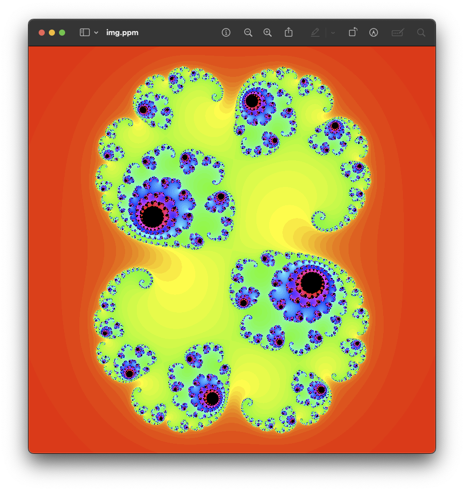

# julia
## PPM format
```
P3                                  -- text RGB image
800 800                             -- image size
255                                 -- max value for the colour
0 0 0      ...      0 0 255         -- RGB values for each pixel
...        ...      ...
255 255 0  ...      255 255 255
```
## Julia fractal
